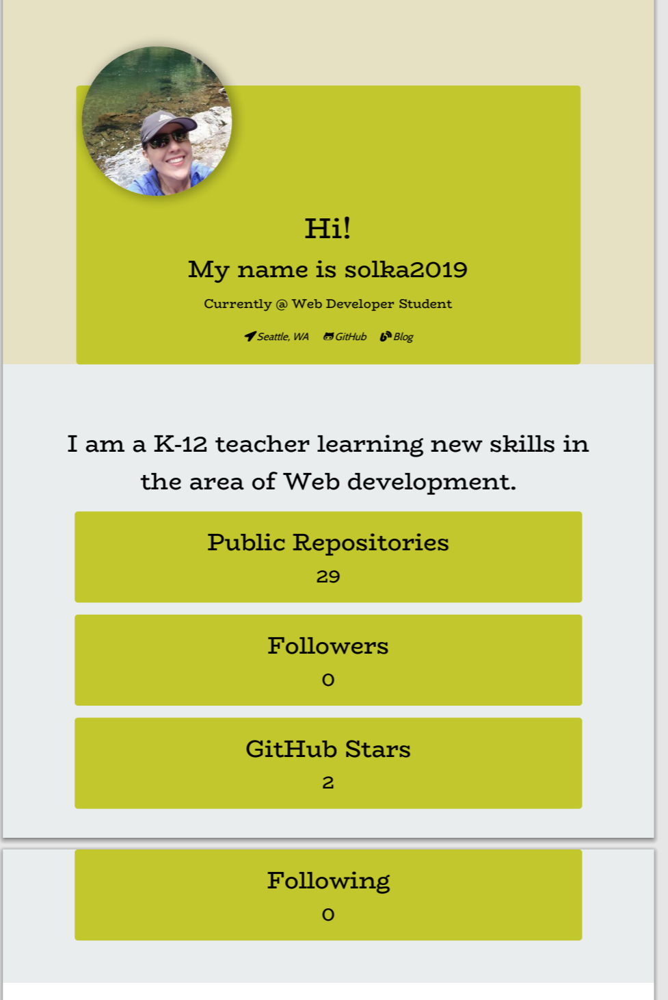

# Developer-Profile-Generator
Homework 09
This is and application in a pdf format that allows the user to see updated information about his/her development team. 
The user will have choices of colors for the background for each developer's card. This PDF profile will contain:
-Profile image
-User name
-Links to the following:
        -User location via Google Maps
        -User GitHub profile
        -User blog
-User bio
-Number of public repositories
-Number of followers
-Number of GitHub stars
-Number of users following

## User Stories
AS A product manager
I WANT a developer profile generator
SO THAT I can easily prepare reports for stakeholders

## My Github 
https://solka2019.github.io/Developer-Profile-Generator/.

## Screenshot

#### Questions:
- My pdf is showing in 2 pages. How do I make it show in one page only?

